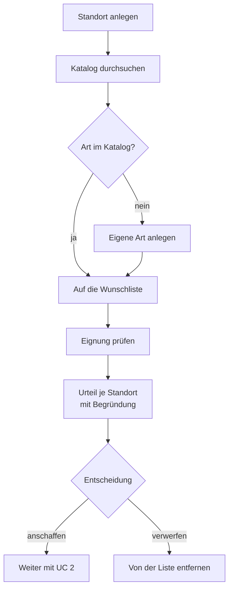
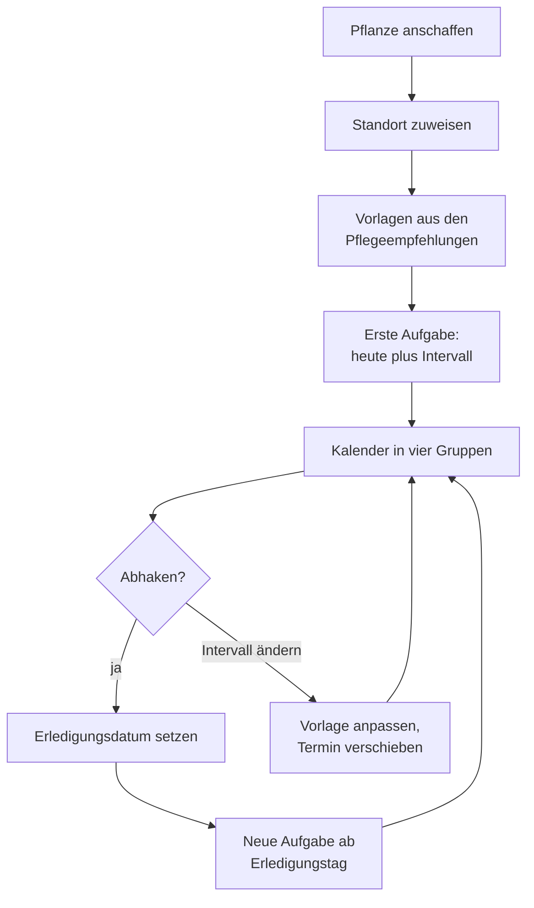

# Fachliche Dokumentation – Care for Plants

Stand: 07.09.2026 · Verantwortlich: Tristan Stracke (Rolle Entwickler) ·
Projekt ISEF01, IU Internationale Hochschule

Dieses Dokument beschreibt, **was** die Anwendung fachlich leistet und nach
welchen Regeln sie entscheidet. Wie sie technisch aufgebaut ist, steht in
der technischen Dokumentation; wie sie zu bedienen ist, im Benutzerhandbuch.

---

## 1 Ausgangslage und Zielgruppe

Zielgruppe sind Privatpersonen, die Zimmer-, Balkon- oder Gartenpflanzen
halten, ohne über gärtnerisches Fachwissen zu verfügen. Zwei Probleme
treten bei dieser Gruppe regelmäßig auf:

**Fehlkäufe.** Eine Pflanze wird nach Aussehen gekauft und an einen Ort
gestellt, der ihren Ansprüchen nicht genügt. Die Folgen zeigen sich erst
nach Wochen und werden dann selten dem Standort zugeschrieben.

**Unregelmäßige Pflege.** Gießen und Düngen folgen keinem festen Rhythmus,
sondern der Erinnerung. Bei mehreren Pflanzen mit unterschiedlichen
Bedürfnissen ist das nicht zu behalten.

Die Anwendung setzt an beiden Punkten an – vor dem Kauf mit einer
Eignungsprüfung, danach mit einem abgeleiteten Pflegeplan.

---

## 2 Abgrenzung zu vergleichbaren Produkten

| Produktart | Was sie leistet | Wo sie den Bedarf nicht deckt |
|---|---|---|
| Pflanzenbestimmung per Foto (PlantNet, Flora Incognita) | Erkennt Arten aus Bildern | Sagt nichts darüber, ob die erkannte Art an einen bestimmten Ort passt |
| Pflegeanwendungen mit Erinnerungen (Planta, Blossom) | Gießerinnerungen, Pflegetipps je Art | Der Standort wird nicht als eigenes Objekt erfasst; ein Abgleich der Merkmale findet nicht statt |
| Pflanzenlexika und Ratgeberseiten | Umfassende Artbeschreibungen | Der Abgleich mit der eigenen Wohnung bleibt Aufgabe des Lesers |
| Allgemeine Aufgabenverwaltungen | Termine mit Wiederholung | Kennen keine Pflanzen; Intervalle müssen selbst recherchiert und eingetragen werden |

**Das Unterscheidungsmerkmal.** Vergleichbare Produkte beschreiben
entweder die Pflanze oder erinnern an eine Aufgabe. *Care for Plants*
erfasst den **Standort als eigenes Objekt mit messbaren Merkmalen** und
vergleicht ihn mit den Ansprüchen der Art. Die Entscheidung wird damit
nicht dem Nutzer überlassen, sondern nachvollziehbar begründet – und der
Pflegeplan entsteht nicht durch Abtippen, sondern wird aus der
Artzuordnung abgeleitet.

Zwei Einschränkungen gehören zur ehrlichen Abgrenzung: Der Katalog umfasst
20 Arten und ist damit um Größenordnungen kleiner als der kommerzieller
Anwendungen, und Erinnerungen außerhalb der Anwendung gibt es nicht. Der
Katalog ist exemplarisch angelegt – er soll die Eignungsprüfung mit
belastbaren Werten versorgen, nicht Vollständigkeit beanspruchen. Fehlende
Arten kann der Nutzer selbst anlegen; die Prüfung arbeitet mit eigenen Arten
genauso wie mit mitgelieferten.

---

## 3 Begriffe

| Begriff | Bedeutung in dieser Anwendung |
|---|---|
| **Standort** | Ein Ort beim Nutzer mit erfassten Merkmalen: Lichtangebot, Minimaltemperatur, Luftfeuchtigkeit, Bodenart, Erreichbarkeit für Kinder und Haustiere |
| **Pflanzenart** | Ein Katalogeintrag mit den Ansprüchen der Art. Entweder mitgeliefert oder vom Nutzer selbst angelegt |
| **Pflanze** | Ein Exemplar beim Nutzer. Entweder *auf der Wunschliste* oder *im Bestand* |
| **Wunschliste** | Pflanzen, die vorgemerkt, aber nicht angeschafft sind. Ohne Standort |
| **Bestand** | Angeschaffte Pflanzen. Immer mit Standort |
| **Eignungsprüfung** | Der Abgleich einer Art mit einem Standort. Ergebnis: Urteil plus Begründung je Kriterium |
| **Pflegeempfehlung** | Am Katalog hinterlegte Empfehlung: Tätigkeit und Abstand für eine Art |
| **Pflegevorlage** | Die Regel für ein Exemplar: Tätigkeit und Abstand für *diese* Pflanze, vom Nutzer änderbar |
| **Pflegeaufgabe** | Ein einzelner Termin mit Fälligkeitsdatum |
| **Tätigkeit** | Gießen, Düngen, Umtopfen, Zurückschneiden, Vermehren |

Die Unterscheidung zwischen *Empfehlung*, *Vorlage* und *Aufgabe* ist
fachlich wesentlich: Die Empfehlung gilt für die Art, die Vorlage für das
Exemplar, die Aufgabe für einen Tag. Nur so lässt sich ein Intervall
ändern, ohne die Vergangenheit umzuschreiben.

---

## 4 Anwendungsfall 1 – Standorte, Wunschliste, Eignungsprüfung

**Ziel:** Der Nutzer erfährt vor dem Kauf, ob eine Pflanze zu einem seiner
Orte passt, und versteht warum.

**Ablauf**

1. Der Nutzer legt einen oder mehrere Standorte mit ihren Merkmalen an.
2. Er durchsucht den Pflanzenkatalog oder legt eine eigene Art an.
3. Er merkt Arten auf der Wunschliste vor.
4. Er lässt eine Art gegen seine Standorte prüfen und erhält je Standort
   ein Urteil mit Begründung zu jedem der fünf Kriterien.
5. Er entscheidet – und kann sich bewusst gegen die Empfehlung entscheiden.

**Ablauf als Diagramm**

**Fachliche Festlegungen**

- Die Prüfung ist **beratend, nicht sperrend**. Eine als ungeeignet
  bewertete Pflanze kann angeschafft werden. Die Anwendung soll informieren,
  nicht bevormunden.
- Ein Standort ist **kein Raum**, sondern ein Platz. Zwei Fenster desselben
  Zimmers sind zwei Standorte, wenn sie unterschiedlich hell sind.
- Selbst angelegte Arten sind **privat**. Ein gemeinsam gepflegter Katalog
  bräuchte Qualitätssicherung, die im Projektumfang nicht zu leisten ist.

---

## 5 Die Regeln der Eignungsprüfung

Fünf Kriterien werden getrennt bewertet, jeweils dreistufig: **erfüllt**,
**grenzwertig**, **verfehlt**.

### 5.1 Licht

Skala von 1 (sehr schattig) bis 5 (sonnig), verglichen wird Angebot minus
Bedarf.

| Abweichung | Bewertung | Begründung |
|---|---|---|
| 0 | erfüllt | Angebot entspricht Bedarf |
| −1 | grenzwertig | Eine Stufe dunkler; die Pflanze wächst langsamer |
| +1 | grenzwertig | Eine Stufe heller; ein Platz weiter vom Fenster ist günstiger |
| < −1 | verfehlt | Deutlich zu dunkel |
| > +1 | verfehlt | Deutlich zu hell, Blattschäden drohen |

Fachlich wichtig: **Zu viel Licht wird ebenso streng bewertet wie zu
wenig.** Direkte Sonne führt bei schattenliebenden Arten zu Blattschäden;
eine nur nach unten offene Skala wäre fachlich falsch.

### 5.2 Temperatur

Verglichen wird die Minimaltemperatur des Standorts mit der
Temperaturuntergrenze der Art.

| Abstand | Bewertung |
|---|---|
| ≥ 2 Grad | erfüllt |
| 0 bis 1 Grad | grenzwertig |
| negativ | verfehlt |

Es gibt **keine Toleranz nach unten**: Fällt die Temperatur unter die
Untergrenze, erfriert die Pflanze, und das ist durch Pflege nicht
auszugleichen. Der Puffer von zwei Grad trägt dem Umstand Rechnung, dass
die erfassten Werte Schätzungen des Nutzers sind.

### 5.3 Luftfeuchtigkeit

Skala von 1 (trocken) bis 3 (feucht), Toleranz eine Stufe in beide
Richtungen. Zu trockene Luft ist durch Besprühen ausgleichbar, zu feuchte
begünstigt Fäulnis.

### 5.4 Bodenart

| Fall | Bewertung |
|---|---|
| Bodenart des Standorts gehört zu den geeigneten der Art | erfüllt |
| Passt nicht, Standort ist Innenraum oder Balkon | grenzwertig |
| Passt nicht, Standort ist Garten | verfehlt |

Der Unterschied ist fachlich begründet: **Im Topf lässt sich das Substrat
beim Umtopfen wechseln, im Beet nicht.** Dieselbe Abweichung wiegt daher je
nach Standortart unterschiedlich schwer.

### 5.5 Giftigkeit

| Fall | Bewertung |
|---|---|
| Pflanze ungiftig | erfüllt |
| Giftig, Standort nicht erreichbar für Kinder und Haustiere | erfüllt |
| Giftig, Standort erreichbar | verfehlt |

Kein Zwischenwert. Hier geht es nicht um das Wohl der Pflanze, sondern um
die Sicherheit von Kindern und Tieren.

### 5.6 Bildung des Gesamturteils

| Bedingung | Urteil |
|---|---|
| mindestens ein Kriterium verfehlt | **ungeeignet** |
| kein verfehltes, mindestens ein grenzwertiges | **bedingt geeignet** |
| alle Kriterien erfüllt | **geeignet** |

Die Kriterien werden **nicht gegeneinander verrechnet**. Ein Standort, an
dem die Pflanze erfriert, wird nicht dadurch geeignet, dass Licht und Boden
stimmen. Ein Punktesystem mit Gewichtungen wurde erwogen und verworfen: Es
hätte Ausschlussgründe kompensierbar gemacht und wäre für den Nutzer nicht
mehr nachvollziehbar gewesen.

Jedes Kriterium liefert seine Begründung im Klartext mit. Ein Urteil ohne
Erklärung wäre für den Nutzer wertlos, weil er nicht wüsste, was er ändern
kann.

---

## 6 Anwendungsfall 2 – Pflegeaufgaben und Kalender

**Ziel:** Der Nutzer weiß täglich, was zu tun ist, ohne Intervalle selbst
zu recherchieren oder zu verwalten.

**Ablauf**

1. Der Nutzer schafft eine Pflanze von der Wunschliste an und weist ihr
   einen Standort zu.
2. Aus den Pflegeempfehlungen der Art entsteht je Tätigkeit eine
   Pflegevorlage mit Intervall; aus jeder Vorlage die erste Aufgabe.
3. Der Kalender zeigt alle offenen Aufgaben in vier Gruppen.
4. Der Nutzer hakt eine Aufgabe ab; die nächste wird berechnet.
5. Bei Bedarf passt er Intervalle an, ergänzt oder entfernt Tätigkeiten.

**Ablauf als Diagramm**

**Fachliche Festlegungen mit Begründung**

- **Der erste Termin liegt ein volles Intervall in der Zukunft.** Eine
  frisch gekaufte Pflanze ist in aller Regel gegossen und gedüngt; alles
  sofort fällig zu stellen wäre fachlich falsch und würde den Kalender beim
  Einstieg mit Scheinaufgaben füllen.
- **Der Folgetermin rechnet ab dem Tag der Erledigung**, nicht ab der
  ursprünglichen Fälligkeit. Wer drei Tage zu spät gießt, soll danach wieder
  den vollen Abstand Zeit haben. Andernfalls bliebe ein einmaliger Rückstand
  dauerhaft bestehen, und der Kalender zeigte auf Dauer Überfälliges an.
- **Erledigte Aufgaben bleiben erhalten.** Beim Abhaken wird das
  Erledigungsdatum gesetzt und eine neue Aufgabe erzeugt. So entsteht eine
  Historie, und ein zweiter Klick erzeugt keine zweite Folgeaufgabe.
- **Je Pflanze und Tätigkeit gibt es genau eine Vorlage.** Zwei Regeln zum
  Gießen derselben Pflanze wären widersprüchlich.
- **Gruppierung nach Dringlichkeit** statt nach Datum: überfällig, heute,
  diese Woche, danach. Die Frage des Nutzers lautet „Was muss ich jetzt
  tun?", nicht „Welches Datum ist welcher Termin?".

---

## 7 Bewusst nicht umgesetzt

| Nicht umgesetzt | Begründung |
|---|---|
| Automatische Pflanzenvorschläge zu einem Standort (ursprünglicher UC 3) | Die Themenbeschreibung verlangt mindestens zwei Anwendungsfälle. Ein Vorschlagsverfahren hätte Gewichtungen erfordert, die ohne Nutzerdaten nicht begründbar sind |
| Benachrichtigung bei fälligen Aufgaben | Erfordert einen Postausgangsserver oder Push-Infrastruktur und damit einen Ausfallpunkt außerhalb der eigenen Kontrolle. In MS 3 als *Won't have* eingestuft |
| Wetterdaten für Standorte im Freien | Fremdschnittstelle mit eigener Ausfallwahrscheinlichkeit; der fachliche Gewinn wäre auf Gartenstandorte beschränkt |
| Gemeinsamer Artenkatalog aller Nutzer | Bräuchte redaktionelle Qualitätssicherung. Falsche Angaben würden sich auf alle Eignungsprüfungen auswirken |
| Fotos zu Pflanzen | Dateiablage, Speicherplatz und Rechtefragen ohne fachlichen Beitrag zu UC 1 und UC 2 |
| Mehrere Personen je Haushalt | Der Zuschnitt richtet sich an Einzelpersonen; gemeinsame Bestände hätten ein Rechtekonzept erfordert |

[EIGENE EINSCHÄTZUNG: Hier gehört dein Urteil hin, welche dieser Streichungen
sich im Nachhinein als richtig erwiesen hat und welche du bei mehr Zeit als
Erstes nachziehen würdest. Ein Satz genügt, aber er sollte begründet sein.]

---

## 8 Datengrundlage des Katalogs

Der mitgelieferte Katalog enthält 20 Arten mit Lichtbedarf,
Temperaturuntergrenze, Luftfeuchtigkeitsbedarf, Wasserbedarf, geeigneten
Bodenarten, Giftigkeit und Pflegeempfehlungen, dazu 77 Pflegeempfehlungen
und fünf Bodenarten. Die Werte wurden von der Rolle Qualität und Test
zusammengetragen und in einem Review geprüft; je Art ist eine Quelle
hinterlegt.

Die Größe des Katalogs ist eine bewusste Entscheidung des Zuschnitts: Zwanzig
sorgfältig belegte Arten sind für die Prüfung der Eignungslogik aussagekräftiger
als mehrere hundert ungeprüfte. Eine Erweiterung ist ohne Änderung am Quelltext
möglich, da der Katalog als Datenbestand geladen wird.

Die Zuordnung ordinaler Werte – etwa „hell" statt einer Beleuchtungsstärke
in Lux – ist eine Vereinfachung. Sie ist bewusst gewählt, weil Nutzer die
Helligkeit ihres Fensters nicht messen, sondern einschätzen. Beide Seiten
des Vergleichs beruhen damit auf derselben groben Skala, was die Aussage
belastbarer macht, als es eine scheingenaue Zahl wäre.

Maßgeblich ist die Fassung V3 der Liste vom 07.09.2026. Gegenüber V2 ist
darin eine Korrektur enthalten: Beim Weihnachtskaktus war als
Temperaturuntergrenze 21 Grad eingetragen – tatsächlich der Wert, bei dem die
Pflanze sich wohlfühlt, nicht der, unter den sie nicht fallen darf. Der Wert
wurde nach Rückfrage auf 10 Grad korrigiert. Der Fehler hätte dazu geführt,
dass die Art für nahezu jeden Wohnraum als bedingt geeignet oder ungeeignet
bewertet worden wäre.
