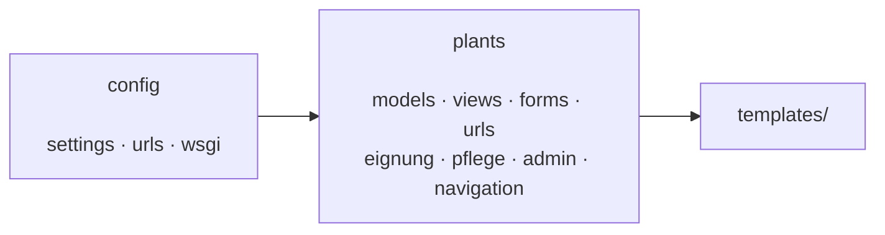
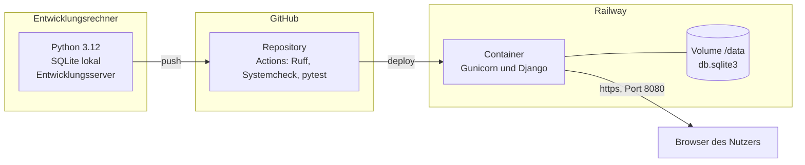
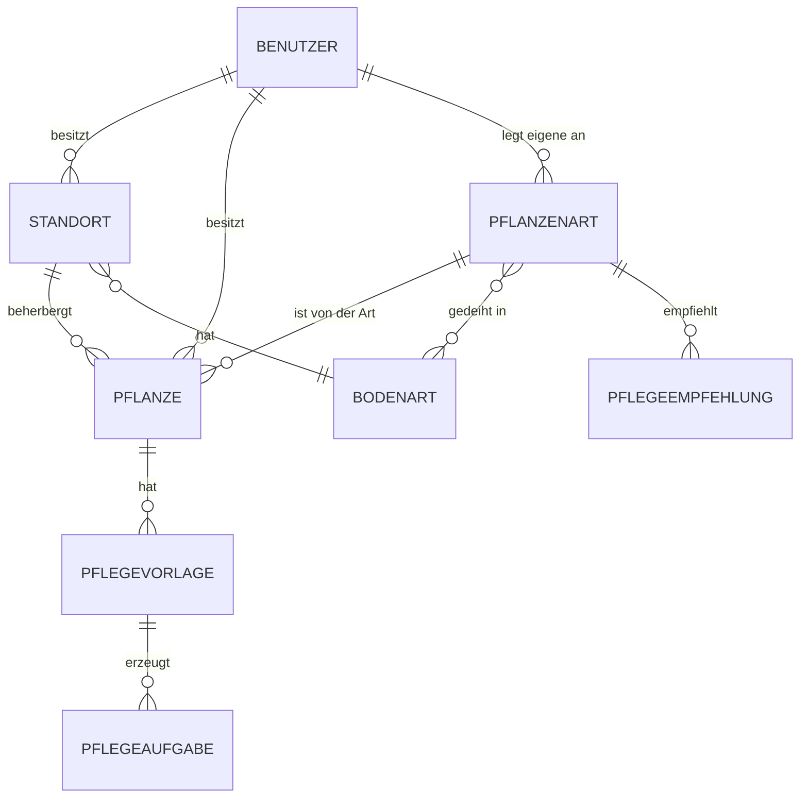

# Technische Dokumentation – Care for Plants

Stand: 07.09.2026 · Verantwortlich: Tristan Stracke (Rolle Entwickler) ·
Projekt ISEF01, IU Internationale Hochschule

---

## 0 Vorbemerkung: Ordnungsrahmen und bewusste Verkürzung

Dieses Dokument folgt **arc42**. Von den zwölf vorgesehenen Kapiteln werden
sieben verwendet: Randbedingungen, Kontextabgrenzung, Lösungsstrategie,
Bausteinsicht, Verteilungssicht, Querschnittskonzepte und
Architekturentscheidungen. Ergänzt sind das Datenmodell und die
Beschreibung der Tabellen.

Nicht verwendet werden:

| Weggelassenes Kapitel | Grund |
|---|---|
| Qualitätsanforderungen, Qualitätsszenarien | werden in der Qualitätsplanung (Rolle Qualität und Test) geführt; eine zweite Fassung liefe auseinander |
| Laufzeitsicht | Die Anwendung hat keine nebenläufigen oder verteilten Abläufe. Jede Interaktion ist ein Anfrage-Antwort-Zyklus; ein Sequenzdiagramm hätte keinen Erkenntniswert |
| Risiken und technische Schulden | im Projektbericht und im Entscheidungslog geführt |
| Glossar | Der Fachbereich umfasst rund fünfzehn Begriffe, die im Text erklärt werden |

Diese Reduktion ist eine bewusste Abwandlung des Rahmenwerks. Sie folgt der
Empfehlung von arc42, nur die Kapitel zu füllen, die für das jeweilige
System Aussagekraft haben, und ist Bestandteil der in MS 3 festgelegten
Konfiguration.

---

## 1 Randbedingungen

**Technisch.** Python 3.12, Django 5.2.17, SQLite. Der Betrieb erfolgt auf
Railway; die Anwendung muss ohne Installation über einen Browser erreichbar
sein und ihren Datenbestand über eine Neuveröffentlichung hinweg behalten.

**Organisatorisch.** Drei Personen, vier Wochen, davon rund zwanzig
Arbeitstage für sieben Meilensteine. Eine Person übernimmt die Entwicklung;
Projektleitung sowie Qualität und Test liegen bei den beiden anderen.

**Fachlich.** Umgesetzt werden zwei Anwendungsfälle: Standorte anlegen und
eine Wunschliste führen samt automatischer Eignungsprüfung (UC 1) sowie
Pflegeaufgaben je Pflanze mit Intervall, Kalender und Abhaken (UC 2). Der
ursprünglich angedachte dritte Anwendungsfall – automatische
Pflanzenvorschläge – ist ausgeschlossen.

**Daraus folgende Leitlinie.** Jede Entscheidung wurde daran gemessen, ob
sie die Erreichbarkeit für den Prüfenden gefährdet. Technisch interessantere
Lösungen mit höherem Betriebsrisiko wurden verworfen; die Begründungen
stehen in Kapitel 7.

---

## 2 Kontextabgrenzung

Die Anwendung ist in ihrem Umfeld nahezu isoliert. Es gibt weder eine
Anbindung an Fremdsysteme noch eingehende Schnittstellen für Dritte.

| Beteiligter | Art | Austausch |
|---|---|---|
| Nutzer (Privatperson) | Mensch | Bedient die Anwendung im Browser: Standorte, Wunschliste, Bestand, Pflegekalender |
| Administrator | Mensch | Verwaltet über die Administrationsoberfläche von Django Konten und Stammdaten |
| Railway | Plattform | Stellt Laufzeitumgebung, Volume und öffentliche Adresse bereit |
| GitHub Actions | Werkzeug | Prüft und veröffentlicht |

**Bewusst nicht vorhanden:** keine Anbindung an eine Wetterdatenquelle,
keine Benachrichtigung per E-Mail oder Push, keine Anmeldung über fremde
Konten. Jede dieser Anbindungen hätte einen Ausfallpunkt außerhalb der
eigenen Kontrolle geschaffen, ohne zu UC 1 oder UC 2 beizutragen. Der
Pflanzenkatalog wird als Datenbestand mitgeliefert und nicht zur Laufzeit
abgerufen.

---

## 3 Lösungsstrategie

| Ziel | Lösungsansatz |
|---|---|
| Ohne Installation bedienbar | Serverseitig gerendertes HTML, kein Aufbau eines eigenen Frontends |
| In vier Wochen umsetzbar | Ein Rahmenwerk, das Anmeldung, Formulare, ORM, Migrationen und Administrationsoberfläche mitbringt |
| Datenbestand übersteht Veröffentlichung | Datenbankdatei auf einem dauerhaften Volume, Pfad über Umgebungsvariable |
| Fachlogik nachweisbar korrekt | Eignungsprüfung und Pflegeableitung als reine Funktionen ohne Datenbankzugriff, dadurch unmittelbar testbar |
| Fehlkonfiguration soll auffallen | Sichere Voreinstellungen, Startabbruch statt stillem Weiterlaufen |

Der wichtigste Zug ist der vierte. Die beiden fachlich anspruchsvollen
Stellen – die Bewertung, ob eine Pflanzenart zu einem Standort passt, und
die Berechnung der nächsten Fälligkeit – sind aus den Ansichten
herausgezogen und arbeiten ausschließlich auf einfachen Werten. Sie lassen
sich dadurch ohne Datenbank und ohne HTTP-Anfrage prüfen, was die hohe
Testdichte an genau diesen Stellen erst möglich macht.

---

## 4 Bausteinsicht

### 4.1 Ebene 1 – Gesamtsystem

`config` enthält Konfiguration und Einstiegspunkte, `plants` die gesamte
Fachlichkeit. Eine Aufteilung in mehrere Django-Anwendungen wurde geprüft
und verworfen: Bei zwei Anwendungsfällen und rund 1 650 Zeilen Quelltext
hätte sie Importwege verlängert, ohne Zuständigkeiten zu klären.

### 4.2 Ebene 2 – Bausteine innerhalb von `plants`

| Baustein | Zeilen | Aufgabe |
|---|---|---|
| `models.py` | 331 | Datenmodell, Wertebereiche als Aufzählungen, Bedingungen auf Datenbankebene |
| `views.py` | 395 | Ansichten: Anfrage entgegennehmen, Fachfunktion aufrufen, Vorlage füllen |
| `eignung.py` | 231 | Eignungsprüfung: fünf Kriterien, ein Gesamturteil – ohne Datenbankzugriff |
| `forms.py` | 177 | Formulare und Eingabeprüfung |
| `pflege.py` | 126 | Ableitung der Pflegeaufgaben, Fälligkeiten, Gruppierung für den Kalender |
| `admin.py` | 64 | Administrationsoberfläche |
| `urls.py` | 49 | Zuordnung von Adressen zu Ansichten |
| `navigation.py` | 34 | Zuordnung von Ansicht zu Menüpunkt für die Navigationsleiste |

**Entwurfsregel.** Die Ansichten enthalten keine Fachlogik. `eignung.py`
und `pflege.py` kennen weder Anfragen noch Antworten; sie erhalten Werte und
geben Werte zurück. Diese Trennung ist der Grund, weshalb die
Bewertungslogik vollständig durch Tests abgedeckt werden konnte.

**Die Eignungsprüfung im Einzelnen.** Fünf Kriterien werden getrennt
bewertet – Licht, Temperatur, Luftfeuchtigkeit, Bodenart, Giftigkeit – und
liefern je eine dreistufige Bewertung mit Begründungstext. Das Gesamturteil
entsteht ohne Verrechnung der Kriterien: Ein einziges verfehltes Kriterium
führt zu "ungeeignet", ein einziges grenzwertiges zu "bedingt geeignet".
Ein Standort, an dem die Pflanze erfriert, wird nicht dadurch geeignet,
dass Licht und Boden stimmen. Die Begründungen werden mitgeführt und
angezeigt; ein Urteil ohne Erklärung wäre für den Nutzer wertlos und für
die Prüfung nicht nachvollziehbar.

**Die Pflegeableitung im Einzelnen.** Beim Anschaffen einer Pflanze entsteht
aus den Pflegeempfehlungen ihrer Art je Tätigkeit eine Vorlage mit
Intervall und daraus die erste Aufgabe. Zwei fachliche Festlegungen sind
hier begründungspflichtig: Die erste Aufgabe fällt ein volles Intervall nach
dem Anschaffen an, weil eine frisch gekaufte Pflanze in aller Regel gegossen
und gedüngt ist. Und die Folgeaufgabe rechnet ab dem Tag der Erledigung, nicht
ab der ursprünglichen Fälligkeit – wer drei Tage zu spät gießt, soll danach
wieder ein volles Intervall Zeit haben, statt einen Rückstand dauerhaft
mitzuschleppen.

---

## 5 Verteilungssicht

Ein einziger Prozess bedient alle Anfragen; statische Dateien liefert
WhiteNoise aus demselben Prozess aus. Es gibt keinen zweiten Dienst, keinen
Zwischenspeicher und keine Warteschlange. Die Einzelheiten des Betriebs –
Variablen, Inbetriebnahme, Wiederanlauf – stehen in der
Betriebsdokumentation.

---

## 6 Querschnittskonzepte

**Zugriffstrennung.** Jede Abfrage auf Daten einer Person ist auf
`besitzer=request.user` eingeschränkt; der Zugriff auf einen fremden
Datensatz führt zu 404, nicht zu 403. Eine Fehlermeldung „keine
Berechtigung" würde die Existenz des Datensatzes bestätigen. Für
Pflanzenarten gilt eine Sonderregel: Der mitgelieferte Katalog ist für alle
sichtbar, selbst angelegte Arten nur für ihren Urheber.

**Wertebereiche.** Licht, Luftfeuchtigkeit und Wasserbedarf sind
Ordinalskalen und als `IntegerChoices` abgebildet. Die Zahlen tragen eine
Ordnung – „hell" ist mehr als „halbschattig" –, und genau diese Ordnung
braucht die Eignungsprüfung für ihre Vergleiche. Freitext oder
Zeichenketten hätten Vergleiche unmöglich gemacht.

**Bedingungen in der Datenbank.** Regeln, die immer gelten müssen, stehen
als `CheckConstraint` in der Datenbank und nicht nur im Formular: Eine
Pflanze auf der Wunschliste darf keinen Standort haben, eine Pflanze im
Bestand muss einen haben; je Pflanze und Tätigkeit darf es nur eine
Pflegevorlage geben. Formulare lassen sich umgehen, die Datenbank nicht.

**Zeitrechnung.** Fälligkeiten werden über `timezone.localdate()` bestimmt,
nicht über `date.today()`. Der Server läuft nach UTC; zwischen Mitternacht
und zwei Uhr wäre dort noch der Vortag, und eine Aufgabe erschiene einen Tag
zu früh als fällig.

**Konfiguration.** Eine Einstellungsdatei, alle Unterschiede über
Umgebungsvariablen, sichere Voreinstellungen. Fehlt der Signaturschlüssel bei
abgeschaltetem Fehlersuchmodus, bricht der Start ab.

**Fehlerbehandlung und Rückmeldung.** Nach jeder verändernden Aktion folgt
eine Weiterleitung mit einer Meldung (Post/Redirect/Get). Das verhindert,
dass ein Neuladen dieselbe Änderung ein zweites Mal auslöst.

**Barrierefreiheit.** Kontraste wurden gegen WCAG 2.1 geprüft; die aktive
Seite ist über `aria-current` ausgezeichnet und zusätzlich über Fläche und
Schriftschnitt erkennbar, nicht über Farbe allein.

**Prüfung und Auslieferung.** Ruff, Systemcheck einschließlich `--deploy`
und die Testreihe laufen vor jeder Veröffentlichung; nur ein vollständig
grüner Lauf erlaubt die Auslieferung. Derzeit umfasst die Testreihe 83
Testfunktionen, mit einem Schwerpunkt auf Eignungsprüfung und
Pflegeableitung, deren Anweisungsüberdeckung bei 100 Prozent liegt.

---

## 7 Architekturentscheidungen

Geführt als **Architecture Decision Records** nach Nygard, allerdings in
verkürzter Form: Datum, Entscheidung, geprüfte Alternativen, Begründung –
ergänzt um einen eigenen Abschnitt für die geprüften Alternativen, weil die
Prüfungsleistung deren Nachvollziehbarkeit ausdrücklich verlangt.

Die Records liegen einzeln unter `docs/adr/`, die fortlaufende Chronik
aller Entscheidungen einschließlich der kleinen und der zurückgenommenen
in `docs/entscheidungslog.md`. Zusammengefasst sind hier die vier
tragenden Entscheidungen; die Records enthalten zusätzlich die sichere
Voreinstellung der Konfiguration (ADR 0005) und das Qualitätstor
(ADR 0006).

**7.1 Django statt eines kleineren Rahmenwerks.**
Geprüft: Flask oder FastAPI mit getrenntem Frontend. Django bringt
Anmeldung, Rechteverwaltung, ORM, Migrationen, Formularprüfung und eine
Administrationsoberfläche mit. Bei vier Wochen Laufzeit ist das der
Unterschied zwischen Umsetzung der Fachlichkeit und Nachbau von
Infrastruktur. Der Preis ist ein größerer Rahmen, als zwei Anwendungsfälle
erfordern.

**7.2 SQLite statt PostgreSQL.**
Geprüft: verwalteter PostgreSQL-Dienst. SQLite braucht keinen zweiten
Dienst, keine Zugangsdaten und keine Netzwerkverbindung; auf einem
dauerhaften Volume übersteht die Datei jede Veröffentlichung. Die
Einschränkung – ein Schreibzugriff zur Zeit, keine Verteilung auf mehrere
Instanzen – ist bei fünf Testkonten ohne Bedeutung. Da ausschließlich der
ORM verwendet wird, wäre ein Wechsel später eine Konfigurationsänderung.

**7.3 Serverseitiges Rendern statt Einzelseitenanwendung.**
Geprüft: React oder Vue mit einer REST-Schnittstelle. Eine getrennte
Oberfläche hätte einen zweiten Bauprozess, einen zweiten Auslieferungsweg
und eine eigene Zustandsverwaltung bedeutet. Der fachliche Gewinn wäre
gering, da beide Anwendungsfälle aus Formularen und Listen bestehen.

**7.4 Fachlogik ohne Datenbankzugriff.**
Geprüft: Bewertung als Methoden der Modelle. Reine Funktionen lassen sich
ohne Datenbank prüfen, was schnelle und zahlreiche Tests ermöglicht. Der
Preis ist ein Übersetzungsschritt in der Ansicht, die Modellwerte in
einfache Werte überführt.

[EIGENE EINSCHÄTZUNG: Hier gehört dein Urteil hin, welche dieser vier
Entscheidungen sich im Verlauf als richtig erwiesen hat und wo du heute
anders entscheiden würdest. Eine Entscheidung, die du im Rückblick
kritisch siehst, ist für die Bewertung wertvoller als vier, die du
verteidigst.]

---

## 8 Datenmodell

### 8.1 Tabellen

| Tabelle | Zweck | Wesentliche Felder |
|---|---|---|
| `Bodenart` | Substratkategorien des Katalogs | Bezeichnung, Beschreibung |
| `Pflanzenart` | Katalog und selbst angelegte Arten | Name, botanischer Name, Lichtbedarf, Temperaturuntergrenze, Luftfeuchtigkeit, Wasserbedarf, giftig, geeignete Bodenarten, Quelle, `erstellt_von` |
| `Pflegeempfehlung` | Empfohlene Tätigkeit je Art | Tätigkeit, Intervall in Tagen, Hinweis |
| `Standort` | Ort beim Nutzer | Bezeichnung, Art (innen/Balkon/Garten), Lichtangebot, Minimaltemperatur, Luftfeuchtigkeit, Bodenart, erreichbar für Kinder und Haustiere |
| `Pflanze` | Wunsch oder Bestand | Besitzer, Art, eigene Bezeichnung, Status, Standort, Notiz |
| `Pflegevorlage` | Pflegeplan je Pflanze | Tätigkeit, Intervall, Hinweis |
| `Pflegeaufgabe` | Einzelner Termin | Fälligkeit, erledigt am |

### 8.2 Begründungen zum Entwurf

**Warum `Pflanzenart` und `Pflanze` getrennt sind.** Die Art trägt die
allgemeingültigen Eigenschaften, die Pflanze das Exemplar beim Nutzer. Ohne
diese Trennung wären die Katalogwerte bei jedem Exemplar dupliziert, und
eine Korrektur im Katalog erreichte die bestehenden Bestände nicht.

**Warum `Pflegevorlage` und `Pflegeaufgabe` getrennt sind.** Die Vorlage
beschreibt die Regel („alle zehn Tage gießen"), die Aufgabe den einzelnen
Termin. Ohne diese Trennung ließe sich weder ein Intervall ändern, ohne die
Vergangenheit umzuschreiben, noch bliebe eine Historie erledigter Aufgaben
erhalten.

**Warum eine erledigte Aufgabe bestehen bleibt.** Beim Abhaken wird
`erledigt_am` gesetzt und eine neue Aufgabe erzeugt, statt die vorhandene
weiterzuschieben. Damit bleibt nachvollziehbar, wann tatsächlich gegossen
wurde – Grundlage für eine spätere Auswertung und zugleich Schutz gegen
Doppelklicks: Eine bereits erledigte Aufgabe erzeugt keine zweite
Folgeaufgabe.

**Warum `Bodenart` eine eigene Tabelle ist.** Eine Art gedeiht in mehreren
Substraten, ein Standort hat genau eines. Diese Asymmetrie – n:m auf der
einen, n:1 auf der anderen Seite – ist mit einer Aufzählung nicht
abbildbar.
